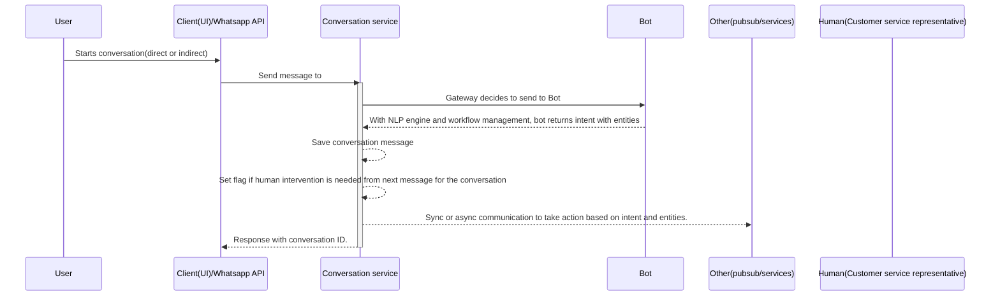

# ReviewBot

## Introduction

This is a system architecture diagram for a messaging service, likely centered around a WhatsApp-based business platform.

The architecture shows a modular design with separate services for different functions, allowing for scalability and flexibility. The system appears designed to handle customer inquiries, automate responses, schedule appointments, process e-commerce transactions, and manage customer relationships, all through a WhatsApp-based interface.

## User interaction flow



Here's a breakdown of the key components:

### User

User usually starts the conversation with the bot. In this case user can start conversation directly or indirectly(webhook in case of webhook API).

### Client/Whatsapp API

Client(FE) can call the APIs directly from the conversation service.

**_Note: Auth is required here._**

Whatsapp API/webhook can also start conversation. In this case the call will be considered internal call and no auth is needed.

### Conversation service

Conversation service is main part where conversation is handled. The message gateway will decide where to send the message(Bot or CSR).

Also it interacts with other services in case of intent based action needs to be taken.

### Bot

Bot consists of NLP to process message and get the response message. It also uses workflow based approach to decide the next best matching response to the current message.

## API Design

### Messaging API

1. Send message(called from Client(UI) or Whatsapp Webhook API)

```http
// Request
POST /api/v1/messages
{
  "conversation_id": "string", // empty for first messge
  "user_id": "string",
  "message": "string"
}

// Response
{
  "conversation_id": "string",
  "user_id": "string",
  "message": "string", // response message (from Bot or CSR)
}
```

2. Retrieve all the messages from conversation

```http
// Request
GET /api/v1/user/{user_id}/messages/{conversation_id}
// Response
{
  "conversation_id": "string",
  "user_id": "string",
  "messages": "[]string"
}
```

## DB Schema design

For now, lets consider the service is responsible for dealing with conversations only.

```go
type Conversation struct {
  ID string
  UserID string
  Messages []Message
}

type Message {
  Timestamp time.Time
  Text string
}
```

## Other(APIs and PubSub)

Please always declare the interface and implement it using adapter patter.

## Metrics

### User Engagement:

- Number of Messages Exchanged: Total messages sent and received.
- Session Duration: Average length of user sessions.

### Response Time:

- Average Response Time: Time taken to respond to user queries.

### Conversion Rates:

- Automated Workflow Success Rate: Percentage of successful automated transactions (e.g., completed purchases, booked appointments).

### User Satisfaction:

- CSAT Scores: Customer satisfaction scores from feedback surveys.
- Feedback Ratings: User ratings on the interaction experience.

### System Performance:

- Latency: Average time taken for system responses.
- Throughput: Number of requests handled per second.
- Error Rates: Frequency of errors encountered.

## Scalability & Reliability Considerations

- Horizontal Scaling: Use container orchestration (e.g., Kubernetes) to scale microservices horizontally.
- Load Balancing: Implement load balancers (e.g., HAProxy, NGINX) to distribute incoming traffic evenly across instances.
- Auto-scaling: Set up auto-scaling policies to handle traffic spikes based on CPU/memory usage and traffic patterns.
- Fault Tolerance: Design services to be stateless where possible and use distributed databases to ensure redundancy.
- Backup & Disaster Recovery: Regularly back up data and have a disaster recovery plan in place to handle system failures.
